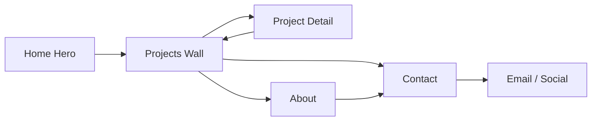

# PRD —— 俊西 (JUNXI) 设计师作品集网站

## 1. Product Overview
- 为设计师「俊西」打造一个具有沉浸式视觉叙事感的个人作品集网站,替代传统 CV,以「设计工作室入口」的形式呈现作品。
- 对标 https://itomdev.com 的创意氛围,采用「深色主题 + 细腻噪点质感 + 大字号排版 + 微交互」的组合,突出设计师品味。

## 2. Core Features

### 2.2 Feature Module
1. **首页 (Entrance)**:沉浸式 Hero,动态大标语,滚动引导,浮动的作品卡片横向滚动墙
2. **作品详情页 (Project Detail)**:大画幅封面 + 详细项目描述 + 图片瀑布流 + 过程稿
3. **关于/理念页 (About)**:个人介绍、服务范围、合作品牌、工作方式
4. **联系页 (Contact)**:联系表单、邮箱、社交链接、地点

### 2.3 Page Details

| Page Name | Module Name | Feature description |
|-----------|-------------|---------------------|
| Home | Hero | 全屏动态渐变背景 + 大字号标语 "JUNXI / Designer" + 鼠标视差 + 滚动箭头 |
| Home | Intro Paragraph | 中文字体段落,描述设计理念,逐字淡入动画 |
| Home | Projects Wall | 横向滚动的作品卡片墙,悬停放大 + 图片位移 |
| Home | Services Grid | 服务项目网格,图标 + 标题 + 简短说明 |
| Home | Contact CTA | 超大"合作邀约"区块,深色背景中反白按钮 |
| Project Detail | Cover | 大画幅项目封面 + 元信息 (客户、年份、品类) |
| Project Detail | Body | Markdown/富文本项目叙述 + 画廊图片瀑布流 |
| About | Profile | 头像 + 个人简介 + 时间轴式经历 |
| About | Services | 可提供的服务清单 (品牌/网页/插画 等) |
| Contact | Form | 姓名 / 邮箱 / 项目描述 表单,本地提交动画 (前端演示) |
| Contact | Socials | Instagram / Behance / Dribbble / 微信二维码 |

## 3. Core Process

用户进入首页 → 查看 Hero → 向下滚动浏览作品墙 → 点击某作品进入详情 → 返回首页或前往 About / Contact → 通过表单或邮箱建立联系。

## 4. User Interface Design

### 4.1 Design Style
- **主色**:近黑 `#0a0a0a`,次色 `#f4efe6`(暖米白)
- **点缀色**:赭石 `#c74c1c` 与 墨绿 `#1f3a2e`,用于强调按钮与标签
- **整体风格**:编辑杂志风 (Editorial) + 暗调画廊 (Gallery) + 细腻噪点颗粒覆盖
- **字体(标题)**:Noto Serif SC / Playfair Display 风格的大号衬线,字间距紧缩
- **字体(正文)**:Inter / Noto Sans SC,轻盈
- **按钮**:3px 圆角,细描边 + 填充悬停动画
- **光标**:自定义小圆点光标,悬停作品卡时放大
- **排版**:左右不对称,元素"漂浮"出网格
- **动效**:滚动触发渐入、图片缓慢位移、悬停位移 + 亮度变化

### 4.2 Page Design Overview

| Page Name | Module Name | UI Elements |
|-----------|-------------|-------------|
| Home | Hero | 深色渐变 + 噪点,居中双行大字 "JUNXI" + "Designer",左下年份标签,右上 "Studio" |
| Home | Projects Wall | 6-8 张宽卡片横向排列,左箭头,悬停放大 1.04× |
| Home | Services Grid | 3×2 网格,图标 + 标题 + 灰色小字描述 |
| Home | CTA | 巨大"Let's talk →"按钮占满半屏 |
| Project Detail | Cover | 全屏宽图 + 顶部导航浮层 + 标题卡片压在图片底部 |
| Project Detail | Body | 双栏正文 + 单栏大图交替 |
| About | Profile | 左图右文,标签云 "品牌/网页/平面/策展" |
| Contact | Form | 大输入框,下划边框风格,发送按钮带加载态 |

### 4.3 Responsiveness
- **Desktop-first**,断点 768px / 1024px
- 移动端 Hero 字号缩小至约 12vw,作品墙改为纵向排列
- 触摸设备禁用自定义光标,改为系统默认
