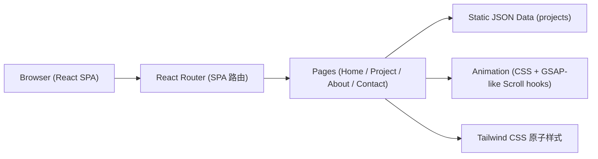

# Technical Architecture —— 俊西 作品集网站

## 1. Architecture Design

纯前端单页应用,作品数据由前端静态 JSON (mock) 驱动,便于独立开发与演示。



## 2. Technology Description
- **前端**:React 18 + TypeScript + Vite
- **路由**:react-router-dom
- **样式**:Tailwind CSS 3 + 自定义 CSS (噪点 / cursor / 渐变 mesh)
- **动效**:纯 CSS 动画 + 自定义 React Hook (基于 IntersectionObserver 实现滚动触发),不引入重型库,保持轻量
- **数据**:src/data/projects.ts 静态数据
- **图标**:lucide-react
- **后端**:无 (联系表单为前端演示态)

## 3. Route Definitions

| Route | Purpose |
|-------|---------|
| `/` | 首页 (Hero + 作品墙 + 服务 + CTA) |
| `/projects/:id` | 作品详情 |
| `/about` | 关于 |
| `/contact` | 联系 |
| `*` | 404 |

## 4. API Definitions

无后端接口,所有作品数据通过 `src/data/projects.ts` 读取。

```ts
// src/types/project.ts
export interface Project {
  id: string;
  title: string;
  subtitle: string;
  year: string;
  client: string;
  category: 'Brand' | 'Web' | 'Editorial' | 'Illustration' | 'Exhibition';
  cover: string;
  gallery: string[];
  description: string;
  tags: string[];
}
```

## 5. 组件拆分建议

```
src/
├─ components/
│  ├─ layout/
│  │  ├─ NavBar.tsx
│  │  └─ Footer.tsx
│  ├─ home/
│  │  ├─ Hero.tsx
│  │  ├─ ProjectsWall.tsx
│  │  ├─ ServicesGrid.tsx
│  │  └─ ContactCTA.tsx
│  ├─ project/
│  │  ├─ ProjectCover.tsx
│  │  ├─ ProjectGallery.tsx
│  │  └─ ProjectBody.tsx
│  ├─ about/
│  │  ├─ Profile.tsx
│  │  └─ Timeline.tsx
│  ├─ contact/
│  │  ├─ ContactForm.tsx
│  │  └─ Socials.tsx
│  └─ shared/
│     ├─ Reveal.tsx    (滚动渐入容器)
│     ├─ Marquee.tsx   (横向滚动文字)
│     └─ CustomCursor.tsx
├─ pages/
│  ├─ Home.tsx
│  ├─ ProjectDetail.tsx
│  ├─ About.tsx
│  └─ Contact.tsx
├─ data/
│  └─ projects.ts
├─ types/
│  └─ project.ts
└─ App.tsx
```

## 6. CSS 全局设计 Token

```css
:root {
  --bg:        #0a0a0a;
  --bg-soft:   #141414;
  --fg:        #f4efe6;
  --fg-dim:    #8e8a82;
  --accent:    #c74c1c;
  --accent-2:  #1f3a2e;
  --line:      rgba(244,239,230,0.12);
}
```
